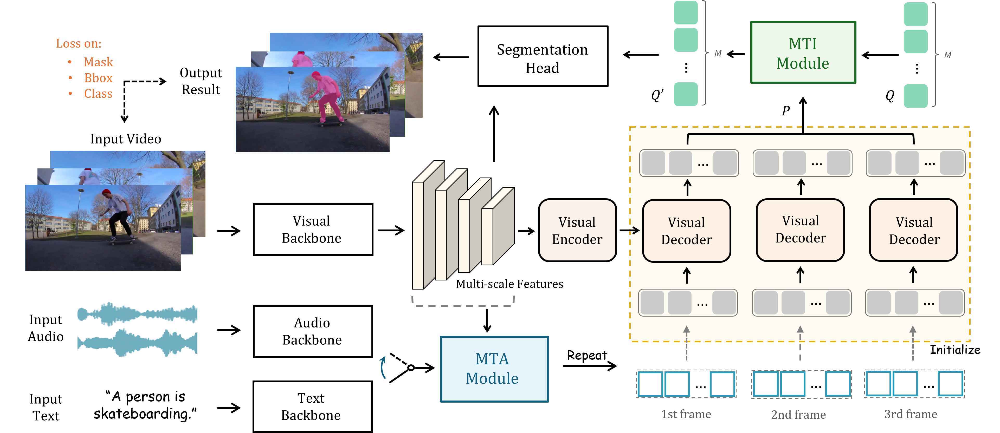

# MUTR: A Unified Temporal Transformer for Multi-Modal Video Object Segmentation

Official implementation of ['Referred by Multi-Modality: A Unified Temporal Transformer for Video Object Segmentation'](https://arxiv.org/pdf/2305.16318).


<!-- <div align="center">
<h1>
<b>
Referred by Multi-Modality: A Unified Temporal <br> Transformer for Video Object Segmentation
</b>
</h1>
</div> -->

## Introduction
We propose **MUTR**, a **M**ulti-modal **U**nified **T**emporal transformer for **R**eferring video object segmentation. With a unified framework for the first time, MUTR adopts a DETR-style transformer and is capable of segmenting video objects designated by either text or audio reference. Specifically, we introduce two strategies to fully explore the temporal relations between videos and multi-modal signals, which are low-level temporal aggregation (MTA) and high-level temporal interaction (MTI).
On Ref-YouTube-VOS and AVSBench with respective text and audio references, MUTR achieves **+4.2\%** and **+4.2\%** J&F improvements to *state-of-the-art* methods, demonstrating our significance for unified multi-modal VOS.

<p align="center"></p>

## Update
* **TODO**: Release the code and checkpoints on AV-VOS with audio reference 📌.
* We release the code and checkpoints of MUTR on RVOS with language reference 🔥.

## Requirements

We test the codes in the following environments, other versions may also be compatible:

- CUDA 11.1
- Python 3.7
- Pytorch 1.8.1


## Installation

Please refer to [install.md](docs/install.md) for installation.


## Data Preparation

Please refer to [data.md](docs/data.md) for data preparation.

After the organization, we expect the directory struture to be the following:

```
MUTR/
├── data/
│   ├── ref-youtube-vos/
│   ├── ref-davis/
├── davis2017/
├── datasets/
├── models/
├── scipts/
├── tools/
├── util/
├── train.py
├── engine.py
├── inference_ytvos.py
├── inference_davis.py
├── opts.py
...
```

## Get Started

Please see [Ref-YouTube-VOS](docs/Ref-YouTube-VOS.md) and [Ref-DAVIS 2017](docs/Ref-DAVIS2017.md) for details.


## Model Zoo and Results

**Note:** 

 `--backbone` denotes the different backbones (see [here](https://github.com/OpenGVLab/MUTR/blob/c4d8901e0fca1da667922d453a004259ffb1a5cd/opts.py#L31)).

 `--backbone_pretrained`  denotes the path of the backbone's pretrained weight (see [here](https://github.com/OpenGVLab/MUTR/blob/c4d8901e0fca1da667922d453a004259ffb1a5cd/opts.py#L33)).


### Ref-YouTube-VOS

To evaluate the results, please upload the zip file to the [competition server](https://competitions.codalab.org/competitions/29139#participate-submit_results).


| Backbone| J&F | J | F | Model | Submission | 
| :----: | :----: | :----: | :----: | :----: | :----: |
| ResNet-50 | 61.9 | 60.4 | 63.4 | [model](https://drive.google.com/file/d/1VEgmQgdsV5fIAkb8zcJ2PVb7k_coZqZe/view?usp=sharing) | [link]() |
| ResNet-101 | 63.6 | 61.8 | 65.4 | [model](https://drive.google.com/file/d/1SM3SxwJvlENAl6F2vVzc8vtW1jrZiPaq/view?usp=sharing) | [link]() |
| Swin-L | 68.4 | 66.4 | 70.4 | [model](https://drive.google.com/file/d/1TSoZLADW6JQhOanFn8yV_ZnIOBn1kqh6/view?usp=sharing) | [link]() |
| Video-Swin-T | 64.0 | 62.2 | 65.8 | [model](https://drive.google.com/file/d/1q9yAJx68UwtGRtjTXECw0dqWPgt2JZnQ/view?usp=sharing) | [link]() |
| Video-Swin-S | 65.1 | 63.0 | 67.1 | [model](https://drive.google.com/file/d/1-lYh3trE9TcaKtes-ETWUCCalieudg1t/view?usp=sharing) | [link]() |
| Video-Swin-B | 67.5 | 65.4 | 69.6 | [model](https://drive.google.com/file/d/1_btRlsRMOpwGceKTCeeW5v7S14Zq7LGX/view?usp=sharing) | [link]() |
| ConvNext-L | 66.7 | 64.8 | 68.7 | [model](https://drive.google.com/file/d/1sYH6JpsqdB0kwW4qkOIcQGAdHsyWyXEL/view?usp=sharing) | [link]() |
| ConvMAE-B | 66.9 | 64.7 | 69.1 | [model](https://drive.google.com/file/d/1kC2052ao_49P_ecKWib5oZEQpxeTvRjq/view?usp=sharing) | [link]() |


### Ref-DAVIS17

As described in the paper, we report the results using the model trained on Ref-Youtube-VOS without finetune.

| Backbone| J&F | J | F | Model | 
| :----: | :----: | :----: | :----: | :----: | 
| ResNet-50 | 65.3 | 62.4 | 68.2 | [model](https://drive.google.com/file/d/1VEgmQgdsV5fIAkb8zcJ2PVb7k_coZqZe/view?usp=sharing) | 
| ResNet-101 | 65.3 | 61.9 | 68.6 | [model](https://drive.google.com/file/d/1SM3SxwJvlENAl6F2vVzc8vtW1jrZiPaq/view?usp=sharing) |
| Swin-L | 68.0 | 64.8 | 71.3 | [model](https://drive.google.com/file/d/1TSoZLADW6JQhOanFn8yV_ZnIOBn1kqh6/view?usp=sharing) |
| Video-Swin-T | 66.5 | 63.0 | 70.0 | [model](https://drive.google.com/file/d/1q9yAJx68UwtGRtjTXECw0dqWPgt2JZnQ/view?usp=sharing) |
| Video-Swin-S | 66.1 | 62.6 | 69.8 | [model](https://drive.google.com/file/d/1-lYh3trE9TcaKtes-ETWUCCalieudg1t/view?usp=sharing) |
| Video-Swin-B | 66.4 | 62.8 | 70.0 | [model](https://drive.google.com/file/d/1_btRlsRMOpwGceKTCeeW5v7S14Zq7LGX/view?usp=sharing) |
| ConvNext-L | 69.0 | 65.6 | 72.4 | [model](https://drive.google.com/file/d/1sYH6JpsqdB0kwW4qkOIcQGAdHsyWyXEL/view?usp=sharing) | 
| ConvMAE-B | 69.2 | 65.6 | 72.8 | [model](https://drive.google.com/file/d/1kC2052ao_49P_ecKWib5oZEQpxeTvRjq/view?usp=sharing) 

## Contact
If you have any question about this project, please feel free to contact tattoo.ysl@gmail.com.
